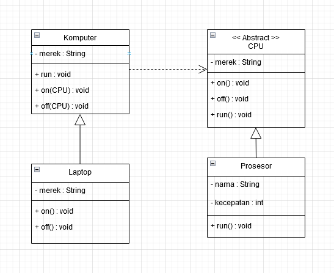

# ProjectUAS

Konsep Dasar OOP

Generalisasi/Inheritance

Abstract Class atau Interface

Class Relationship

GUI/Even Driven

## Link Dokumen

Link PDF   : https://bit.ly/3Gj8lcm

Link Video : https://bit.ly/3CqH5HU

## Penjelasan Program

Komputer.java mempunyai kelas turunan kelas Laptop.Java dan mempunyai relasi class Dependency dengan kelas CPU.java

CPU.java kelas abstract mempuyai method abstract yang di implentasikan pada kelas turunannya yaitu Prosesor.java

